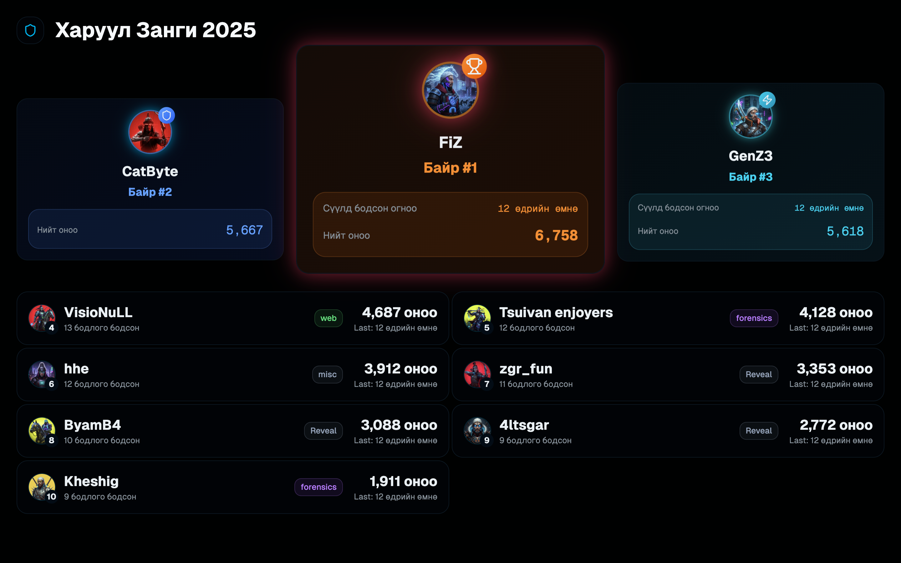

# Haruul Zangi CTF 2025

## About the Event
The 12th annual and largest cybersecurity competition in Mongolia consisted of three rounds, with the final round held in the Shangri-La Ballroom, Ulaanbaatar, during the MNSEC 2025 event.

## Organizers and sponsors
We have organized Haruul Zangi CTF 2025 with the support of the following amazing organizations and people who are passionate about cybersecurity.

### Organizers
- [MNCERT/CC](https://mncert.org)

### Sponsors:
- [Ssystems](https://ssystems.mn/)
- [Nest Education IT School](https://nhs.edu.mn/)

## Contact Information
For inquiries about the competition, please contact:
- Email: hz@haruulzangi.mn
- Social Media: [CTFtime](https://ctftime.org/ctf/985), [Facebook Page](https://www.facebook.com/haruulzangiCTF)
